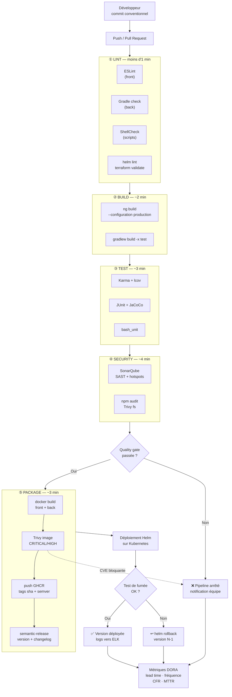
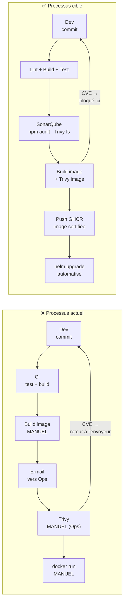

# 03 — Normalisation et plan du pipeline CI/CD

> **Entrée** : `docs/01-audit-swot.md` (constats) et `docs/02-veille-recommandations.md` (outils retenus).
> **Objet** : structure cible du pipeline, **ordre d'exécution argumenté** (critère d'évaluation
> explicite du guide mentor), conventions de nommage, stratégie de branches, portes de qualité,
> artefacts et gestion des secrets.

---

## 1. Principes directeurs

Cinq principes gouvernent la conception du pipeline ; chacun découle d'un constat de l'audit.

| # | Principe | Constat d'origine | Traduction concrète |
|---|---|---|---|
| **P1** | **Fail fast** — échouer au plus tôt, au moins cher | G5 : `npm ci` exécuté 2× sans cache | Les contrôles sont ordonnés par **coût croissant** : ce qui coûte 10 s passe avant ce qui coûte 5 min |
| **P2** | **Shift-left sécurité** — le contrôle appartient à celui qui introduit le défaut | **G1, incident CVE** : contrôle en aval, par l'Ops, à la main | SAST, SCA et scan d'image **dans le pipeline du Dev**, avant tout envoi à l'Ops |
| **P3** | **Un artefact unique, construit une fois** (*build once, deploy many*) | f2 : l'artefact livré n'est pas produit par la CI | L'image est construite **une seule fois**, identifiée par le SHA du commit, et c'est **cette image exacte** qui est scannée, testée puis promue |
| **P4** | **Traçabilité de bout en bout** | f4, S9 : « quelle version tourne sur la démo ? » sans réponse | Commit → tag sémantique → tag d'image → release déployée, chaîne ininterrompue |
| **P5** | **Reproductibilité stricte** | f5, M4, S3 : images de base flottantes | Toute image de base, action et version d'outil est **épinglée** ; aucun `latest` |

> **Conséquence de P3 sur l'ordre** : le scan de sécurité de l'image **ne peut pas** précéder la
> construction de l'image. C'est cette contrainte, et non une préférence, qui place l'étape
> `security` après `package` pour la partie conteneur — point détaillé en §4.

---

## 2. Conventions de nommage

### 2.1 Modèle de branches

#### Les trois modèles évalués

| Critère | Git Flow | GitHub Flow | **Trunk-Based** |
|---|---|---|---|
| Branches permanentes | `main` et `develop` | `main` | **`main` seule** |
| Branches temporaires | `feature/*`, `release/*`, `hotfix/*` | `feature/*` | Branches très courtes, moins de 24 h |
| Durée de vie d'une branche | Jours à semaines | Jours | **Heures** |
| Fusion vers `main` | Via `release/*` | Directe, après revue | **Directe, après revue** |
| Effet sur le *lead time* | **Dégradé** — deux niveaux d'intégration | Correct | **Optimal** |
| Risque de conflit | Élevé, branches longues | Moyen | **Faible** |
| Adapté à | Versions livrées à des clients, support de plusieurs versions | Applications web, équipes moyennes | **Livraison continue, petites équipes** |

#### Modèle retenu pour Orion : Trunk-Based Development

| Branche | Rôle | Durée de vie | Protection cible |
|---|---|---|---|
| `main` | Source de vérité, toujours déployable | Permanente | Revue exigée, CI verte requise |
| `feat/<sujet>` | Nouvelle fonctionnalité | Moins de 24 h | — |
| `fix/<sujet>` | Correction | Moins de 24 h | — |
| `chore/<sujet>` | Outillage, CI, documentation | Moins de 24 h | — |

**Trois raisons, toutes rattachées au contexte d'Orion.**

1. **La taille de l'équipe.** Quatre développeurs et deux exploitants. Git Flow suppose des rôles
   distincts — qui prépare la release, qui la valide, qui la publie — que cette équipe n'a pas. La
   cérémonie de fusion coûterait plus qu'elle ne rapporte.

2. **L'objectif de délai.** Le projet vise explicitement à améliorer le *lead time*, l'un des quatre
   indicateurs DORA. Git Flow ajoute **deux niveaux d'intégration** entre l'écriture d'un commit et
   sa livraison : `feature` vers `develop`, puis `develop` vers `main` via une `release`. Chaque
   niveau ajoute de l'attente. Choisir Git Flow reviendrait à dégrader volontairement l'indicateur
   que l'on cherche à améliorer.

3. **L'absence de versions à maintenir en parallèle.** Git Flow existe pour supporter simultanément
   plusieurs versions livrées à des clients distincts. MicroCRM est une application web à version
   unique : la branche `hotfix/*` n'aurait jamais d'usage réel.

**GitHub Flow était le concurrent sérieux** — il est proche, et l'écart tient à la durée de vie des
branches. Le trunk-based impose des branches de moins de 24 heures, ce qui force à découper le
travail en incréments livrables. C'est une contrainte utile pour une équipe qui n'a pas encore figé
ses conventions, puisqu'elle empêche mécaniquement les branches longues et les fusions douloureuses.

#### Cohérence avec le reste de la chaîne

Le modèle de branches n'est pas un choix isolé : il conditionne trois autres décisions.

| Décision liée | Lien avec le trunk-based |
|---|---|
| **Commits conventionnels** | La version est déduite des commits fusionnés dans `main` ; sans intégration continue dans `main`, `semantic-release` n'aurait pas de source fiable |
| **Une release par fusion sur `main`** | Possible seulement parce que `main` est toujours déployable |
| **Portes de qualité bloquantes** | C'est ce qui rend `main` toujours déployable : sans elles, l'intégration directe deviendrait dangereuse |

> Le trunk-based n'est viable **que** parce que le pipeline est strict. Un modèle de branches
> permissif et une chaîne permissive donnent un dépôt cassé ; un modèle permissif et une chaîne
> stricte donnent un dépôt sain. C'est la chaîne qui autorise la simplicité du modèle, pas l'inverse.

#### Ce qui a réellement été pratiqué sur ce projet — et l'écart assumé

Il faut être précis, car l'historique du dépôt est public et vérifiable.

| Mesure | Valeur réelle |
|---|---|
| Branches créées | **1** — `main` uniquement |
| Commits | **52** |
| Fusions | **0** |
| Pull requests | **0** |
| Protection de `main` | **Non activée** |
| Durée du projet | 3 jours |

**Ce projet a donc été mené en trunk-based « pur »**, avec des commits directs sur `main` — sans
branches de fonctionnalité ni revue par les pairs.

**Motif** : le projet est réalisé par **une seule personne**. Une pull request n'a de sens que s'il
existe un relecteur ; s'auto-approuver ses propres demandes de fusion serait une cérémonie vide,
qui donnerait l'apparence d'un processus de revue sans en produire aucun bénéfice.

**Ce qui a été conservé du modèle**, et qui compte davantage que la mécanique des branches :

- chaque commit respecte la convention et alimente le versionnement automatique ;
- **le pipeline complet s'exécute sur chaque commit poussé sur `main`** — les portes de qualité sont
  donc appliquées à chaque changement, exactement comme elles le seraient sur une pull request ;
- `main` est restée déployable : les 52 commits sont tracés, et chaque échec de pipeline a été
  corrigé avant le commit suivant.

**Ce qui changerait avec l'équipe d'Orion** :

| Élément | Aujourd'hui, projet solo | Avec 4 développeurs |
|---|---|---|
| Branches de fonctionnalité | Non utilisées | Systématiques, moins de 24 h |
| Revue par les pairs | Impossible | Une approbation exigée |
| Protection de `main` | Non activée | Activée : revue et CI verte requises |
| Contrôles de qualité | **Déjà appliqués à chaque commit** | Identiques, déplacés sur la pull request |

> L'écart porte donc sur la **revue humaine**, pas sur les contrôles automatisés : ceux-ci
> s'exécutent déjà sur l'intégralité des changements. C'est la partie du modèle qui exige une équipe,
> et qui ne pouvait pas être simulée honnêtement sur un projet individuel.

### 2.2 Commits — Conventional Commits (en français)

```
<type>(<portée>): <description à l'impératif>
```

Types : `feat`, `fix`, `docs`, `style`, `refactor`, `perf`, `test`, `build`, `ci`, `chore`.
Portées : `front`, `back`, `ci`, `docker`, `helm`, `terraform`, `ansible`, `elk`, `scripts`, `docs`.

**Ce n'est pas une convention cosmétique** : c'est l'**entrée de `semantic-release`**. `fix:` produit
une version *patch*, `feat:` une *mineure*, `BREAKING CHANGE:` une *majeure*. Le message de commit
devient la source de vérité du versionnement (P4).

### 2.3 Versions et tags d'images

| Tag | Exemple | Usage |
|---|---|---|
| `sha-<sha court>` | `sha-a1b2c3d` | **Immuable** — identifie sans ambiguïté le commit ; c'est ce tag qui est déployé |
| `<major>.<minor>.<patch>` | `1.4.0` | Release sémantique produite par `semantic-release` |
| `<major>.<minor>` / `<major>` | `1.4` / `1` | Alias glissants de commodité |
| `latest` | — | **Uniquement** sur la dernière release de `main`, **jamais utilisé pour déployer** |

> **Règle de traçabilité** : un déploiement référence **toujours** un tag immuable (`sha-` ou semver
> exact). Déployer `latest` reproduirait f4 — l'impossibilité de savoir ce qui tourne.

### 2.4 Nommage des images

```
ghcr.io/<propriétaire>/orion-microcrm-front:<tag>
ghcr.io/<propriétaire>/orion-microcrm-back:<tag>
```

*(L'étage `standalone` du Dockerfile fourni n'est pas publié : il copie deux systèmes de fichiers
entiers — constat A6 — et n'a de sens qu'en développement local.)*

---

## 3. Structure cible du pipeline

Le pipeline comporte **5 étapes** exécutées en séquence, avec parallélisation **à l'intérieur** de
chaque étape entre les composants `front` et `back`.

```
① lint  →  ② build  →  ③ test  →  ④ security  →  ⑤ package
```

| # | Étape | Jobs | Durée cible | Bloquant ? |
|---|---|---|---|---|
| ① | **lint** | `lint-front` (ESLint), `lint-back` (Gradle check), `lint-scripts` (ShellCheck), `lint-helm`, `lint-terraform` (fmt/validate) | < 1 min | **Oui** |
| ② | **build** | `build-front` (`ng build --configuration production`), `build-back` (`gradlew build -x test`) | ~2 min | **Oui** |
| ③ | **test** | `test-front` (Karma + lcov), `test-back` (JUnit + JaCoCo), `test-scripts` (bash_unit) | ~3 min | **Oui** |
| ④ | **security** | `sonarqube` (SAST + quality gate + hotspots), `deps-scan` (`npm audit`, Trivy `fs`), `image-scan` (Trivy `image`) | ~4 min | **Oui** (seuils §5) |
| ⑤ | **package** | `docker-build-push` (GHCR, tags sha + semver), `release` (semantic-release, sur `main`) | ~3 min | **Oui** |

---

## 4. Ordre d'exécution — **argumentation**

> *Critère explicite du guide mentor : « Le découpage des étapes du pipeline doit être documenté et
> argumenté (ordre d'exécution). »*

### 4.1 Pourquoi `lint` en premier

Le lint est **l'étape la moins coûteuse** (quelques secondes, sans compilation ni dépendances lourdes)
et détecte une classe d'erreurs fréquente chez une équipe **Débutante en Java et Gradle** (constat A3 :
une dépendance déclarée deux fois dans `build.gradle`). Placer 10 secondes de lint devant 5 minutes de
build et de tests applique le principe **P1** : le retour d'information le plus rapide possible, au
coût le plus faible. C'est aussi la réponse la plus directe à la demande de l'équipe Dev (« éviter
d'intégrer des mauvaises pratiques »).

### 4.2 Pourquoi `build` avant `test` (et non l'inverse comme aujourd'hui)

Le pipeline actuel exécute `test` **avant** `build` (`.gitlab-ci.yml` : `stages: [test, build]`). Cet
ordre est doublement contre-productif :

1. **Il est illogique pour du code compilé.** `./gradlew test` compile déjà les sources — un échec de
   compilation remonte donc comme un échec de test, ce qui **masque la nature réelle du problème**.
2. **Il duplique le travail** (constat C5/G5) : `test-front` exécute `npm ci`, puis `build-front`
   recommence. Le pipeline paie deux fois l'étape la plus lente.

L'ordre cible `build → test` sépare nettement « **le code compile-t-il ?** » de « **le code
fonctionne-t-il ?** », et permet de **réutiliser les artefacts de compilation** via cache et artefacts.
Gain attendu : suppression d'une installation complète de dépendances par pipeline.

### 4.3 Pourquoi `security` après `test`

Deux raisons, l'une économique, l'autre technique :

- **Économique** : l'analyse SonarQube est l'étape la plus longue (~3 à 4 min). Il est inutile de
  l'engager sur du code dont les tests unitaires échouent déjà.
- **Technique — contrainte forte** : SonarQube **consomme les rapports de couverture** (`lcov` pour le
  front, JaCoCo XML pour le back), qui n'existent qu'**après** l'exécution des tests. Placer Sonar
  avant `test` reviendrait à publier une couverture de 0 % et à rendre la quality gate ininterprétable.

### 4.4 Pourquoi `image-scan` doit venir **après** la construction de l'image

C'est la subtilité centrale de l'ordonnancement, et elle mérite d'être explicite.

Le principe **P3** impose de ne construire l'image **qu'une seule fois**. Or on ne peut pas scanner une
image qui n'existe pas encore. La séquence retenue est donc :

```
build de l'image (chargée localement, NON publiée)
        ↓
Trivy image  →  ÉCHEC ⇒ le pipeline s'arrête, rien n'est publié
        ↓
push vers GHCR
```

**Conséquence directe et voulue : une image vulnérable n'atteint jamais le registre.** C'est la
traduction technique exacte du besoin de l'équipe Ops — « analyser les images **en amont de leur
transmission** pour éviter les retours à l'envoyeur ». Le scan est *à l'intérieur* de l'étape
`package`, entre le `build` et le `push`, et non dans une étape ultérieure : c'est ce qui le rend
réellement bloquant.

*(Les analyses qui n'ont pas besoin de l'image — SAST Sonar, `npm audit`, Trivy `fs` sur les
dépendances — restent en étape ④, plus tôt, conformément à P1.)*

### 4.5 Pourquoi `package` en dernier

`package` produit et publie l'artefact livrable. Il ne s'exécute **que** si les quatre étapes
précédentes sont vertes. C'est la matérialisation de la promesse : **tout ce qui est présent dans GHCR
a été linté, construit, testé, analysé et scanné.** Le registre cesse d'être un dépôt de fichiers pour
devenir un **journal des versions certifiées**.

### 4.6 Ce qui est parallélisé, et pourquoi

`front` et `back` sont **indépendants** : leurs jobs s'exécutent en parallèle **au sein** de chaque
étape. La barrière entre étapes est en revanche maintenue, car chaque étape consomme la sortie de la
précédente (P1 : ne pas engager de coût sur une base déjà cassée). Le chemin critique est ainsi celui
du composant le plus lent, non la somme des deux.

---

## 5. Portes de qualité (*quality gates*)

| Porte | Outil | Seuil | Action si dépassé |
|---|---|---|---|
| Lint front | ESLint | 0 erreur (avertissements tolérés) | ❌ Bloque |
| Lint scripts | ShellCheck | 0 erreur | ❌ Bloque |
| Tests unitaires | Karma / JUnit | 100 % de réussite | ❌ Bloque |
| Couverture | JaCoCo + lcov | **≥ 60 %** sur le code nouveau | ⚠️ Avertit puis bloque (§5.1) |
| Quality gate | SonarQube | Gate « Sonar way » passée | ❌ Bloque |
| Security hotspots | SonarQube | 100 % **revus** (revus ≠ corrigés) | ⚠️ Avertit, revue obligatoire avant release |
| Dépendances | `npm audit` / Trivy `fs` | 0 `CRITICAL` **corrigible** | ❌ Bloque |
| Image | Trivy `image` | 0 `CRITICAL`/`HIGH` **corrigible** | ❌ Bloque **avant push** |
| Charts | `helm lint` + `helm template` | 0 erreur | ❌ Bloque |
| IaC | `terraform fmt -check` + `validate` | 0 erreur | ❌ Bloque |

### 5.1 Politique de seuils — pourquoi pas « zéro défaut »

Deux ajustements sont assumés, et défendus :

1. **Couverture à 60 %, pas 80 %.** L'équipe est **Débutante en JUnit** et le projet en est à son 2ᵉ
   sprint. Un seuil inatteignable serait désactivé dès la première urgence — un garde-fou contourné ne
   protège plus rien. Le seuil porte sur le **code nouveau** (*new code*), ce qui évite d'exiger la
   reprise rétroactive de l'existant tout en garantissant que la dette **cesse de croître**.
2. **Trivy bloque sur les vulnérabilités *corrigibles* (`--ignore-unfixed`).** Bloquer sur une CVE sans
   correctif publié en amont revient à bloquer le pipeline sur un problème que l'équipe **ne peut pas
   résoudre** : la seule issue serait de désactiver le contrôle. Les CVE non corrigibles sont
   **rapportées et suivies**, pas ignorées.

---

## 6. Matrice des déclenchements

| Événement | ① lint | ② build | ③ test | ④ security | ⑤ package | Déploiement |
|---|:---:|:---:|:---:|:---:|:---:|:---:|
| *Push* sur `feat/*`, `fix/*` | ✅ | ✅ | ✅ | ⚠️ Sonar seul | ❌ | ❌ |
| *Pull Request* → `main` | ✅ | ✅ | ✅ | ✅ complet | ✅ build **sans push** | ❌ |
| *Push* / merge sur `main` | ✅ | ✅ | ✅ | ✅ complet | ✅ **push GHCR** + release | ✅ staging (auto) |
| Tag `v*.*.*` | ✅ | ✅ | ✅ | ✅ complet | ✅ promotion des tags | ✅ prod (**manuel**) |
| Planifié (hebdomadaire) | ❌ | ❌ | ❌ | ✅ **re-scan des images publiées** | ❌ | ❌ |

**Deux choix à souligner** :

- **Sur PR : l'image est construite et scannée, mais pas publiée.** L'auteur obtient le verdict complet
  de sécurité *avant* la fusion, sans polluer le registre avec des images jetables.
- **Un scan hebdomadaire planifié** ré-analyse les images **déjà publiées**. Il répond directement à la
  menace M4 : une image immuable **devient** vulnérable avec le temps, sans qu'aucun commit ne le
  signale. Sans exécution planifiée, la CVE n'est découverte que par l'Ops — c'est-à-dire trop tard,
  exactement comme dans l'incident initial.

---

## 7. Artefacts, cache et rétention

| Artefact | Produit par | Consommé par | Rétention |
|---|---|---|---|
| `front/dist/` | `build-front` | `docker-build-push` | 7 j |
| `back/build/libs/*.jar` | `build-back` | `docker-build-push` | 7 j |
| `coverage/lcov.info` | `test-front` | `sonarqube` | 7 j |
| `jacocoTestReport.xml` | `test-back` | `sonarqube` | 7 j |
| Rapports Trivy (SARIF/JSON) | `image-scan` | Rapport de sécurité, GitHub Security | 30 j |
| Images `front` / `back` | `docker-build-push` | Déploiement Helm | GHCR (durable) |

**Caches** : dépendances npm (clé = empreinte de `package-lock.json`), cache Gradle (clé = empreinte
des `*.gradle`), cache de couches Docker (GitHub Actions cache). Objectif : supprimer la double
installation de dépendances constatée en C5 et ramener la durée du pipeline sous **12 minutes**.

---

## 8. Gestion des secrets

> *Exigence du guide mentor : « Les secrets liés à l'utilisation de services externes (registre
> d'images par exemple) et les risques associés à la fuite d'information doivent être identifiés et
> documentés. »*

| Secret | Stockage | Portée | Rotation |
|---|---|---|---|
| Publication GHCR | `GITHUB_TOKEN` (**natif, éphémère**) | Job, `packages: write` | Automatique à chaque exécution |
| `SONAR_TOKEN` | GitHub Secrets (chiffré, masqué) | Dépôt | Manuelle, trimestrielle |
| Mot de passe base de données | Secret Kubernetes par *namespace* | Cluster | Manuelle |
| `kubeconfig` | Poste opérateur, **jamais versionné** (`.gitignore`) | Local | — |

**Règles applicables sans exception** :

1. **Aucun credential dans le dépôt** — `.gitignore` couvre `.env`, `*.pem`, `*.key`, `kubeconfig` ;
   la présence de secrets est vérifiée par Trivy `fs` (mode *secret*) et par SonarQube.
2. **Permissions minimales par workflow** : `permissions: contents: read` par défaut, élevées
   uniquement sur le job qui en a besoin (`packages: write` sur le seul job de publication).
3. **Le `GITHUB_TOKEN` est privilégié partout où c'est possible** : il est régénéré à chaque
   exécution, ce qui **supprime la classe de risque des jetons de registre longue durée** (M3).
4. **Aucun secret dans les logs** : masquage natif, et aucun `echo` de variable sensible dans les
   scripts.

---

## 9. Schéma du workflow CI/CD



### 9.1 Position des contrôles de sécurité (shift-left)



**Ce que le schéma démontre** : la boucle de retour passe d'un aller-retour **inter-équipes par
e-mail, après construction manuelle** (délai : heures à jours, coût : deux équipes mobilisées) à une
boucle **intra-pipeline** (délai : minutes, coût : le pipeline). Le goulot G1 disparaît, et l'équipe
Ops cesse d'être le contrôle qualité de l'équipe Dev.

---

## 10. Structure du dépôt

```
oc-devops-p6-orion/
├── .github/workflows/     # ci.yml, release.yml, scan-planifie.yml
├── app/                   # application MicroCRM fournie (Angular 17 + Spring Boot 3)
│   ├── front/             # Angular 17
│   ├── back/              # Spring Boot 3 / Gradle
│   └── Dockerfile         # multi-stage : front, back, standalone
├── scripts/               # install-deps.sh, run-tests.sh, deploy-build.sh,
│                          # backup.sh, notify.py, dora-metrics.py
├── helm/                  # charts par composant, values par environnement
├── terraform/             # modules commentés (namespaces, quotas, releases)
├── ansible/               # playbooks documentés (prérequis, déploiement, back-up)
├── elk/                   # stack de journalisation + tableaux de bord Kibana
└── docs/                  # 01 → 09, contexte/, captures/, JOURNAL_IA.md
```

---

## 11. Trajectoire de mise en œuvre

Le pipeline est construit **progressivement**, conformément au conseil du guide mentor
(« décomposer les tâches complexes et les intégrer progressivement »). Chaque incrément laisse le
pipeline vert.

| Incrément | Contenu | Constats levés |
|---|---|---|
| 1 | lint + build + test, avec cache et artefacts | C3, C5, C8, G5 |
| 2 | Scripts d'automatisation + ShellCheck + bash_unit | f3, exigence livrable |
| 3 | SonarQube + couverture + `npm audit` | S1, C6, C7, f7, G6 |
| 4 | Docker durci (épinglé, non-root, `EXPOSE` corrigé) + Trivy + push GHCR | **S3, S4, A5, f2, f5, G1, G2** |
| 5 | Helm + Kubernetes + rollback testé | **f8, G3** |
| 6 | Terraform + Ansible + ELK + DORA | S7, f9, pilotage |
| 7 | semantic-release + back-up + documentation finale | **f4, f8, S8, S9, G4** |

---

## 12. Indicateurs de succès

| Indicateur | Avant (mesuré) | Cible |
|---|---|---|
| Étapes du pipeline | 2 (test, build) | 5 (lint, build, test, security, package) |
| Contrôles de sécurité automatisés | **0** | 4 (SAST, hotspots, dépendances, image) |
| Images produites par la CI | **0** (100 % manuelles) | 2 publiées, signées par un tag immuable |
| Traçabilité de version | `0.0.1-SNAPSHOT` figé | semver + SHA de commit |
| Durée du pipeline | non mesurée | < 12 min |
| Couverture mesurée | **0 %** (non collectée) | ≥ 60 % sur le code nouveau |
| Délai de détection d'une CVE | après transmission à l'Ops (jours) | **dans le pipeline (minutes)** |
| Déploiement | manuel, `docker run` | `helm upgrade` automatisé |
| Rollback | **inexistant** | `helm rollback`, **testé** |

➡️ **Suite** : Phase 2 — mise en œuvre du pipeline `.github/workflows/ci.yml` et des scripts
d'automatisation dans `scripts/`.
