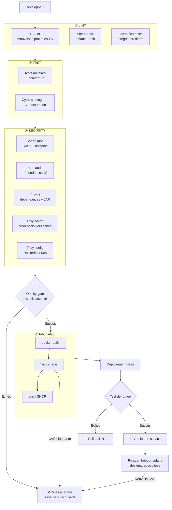

# 05 — Plan de sécurité

> **Projet** : P6 « Gérez une démarche DevOps » — Option B (scénario Orion)
> **Application** : MicroCRM — Angular 17 + Spring Boot 3.2.5 / Java 17
> **Auteur** : Ilyasse JAIEL — Expert DevOps
> **Documents liés** : `01-audit-swot.md` (lacunes S1–S9), `03-normalisation-plan-ci.md` (pipeline et
> secrets), `04-plan-tests.md` (volet tests)

---

## 1. Contexte et constat de départ

L'audit a établi un fait qui structure tout ce plan : **la sécurité d'Orion n'est pas absente, elle
est mal placée.**

L'équipe Ops utilise déjà Trivy — mais **après** réception de l'image, à la main, en aval de la chaîne.
C'est exactement ce mécanisme qui a produit l'incident documenté dans les sondages : des CVE présentes
dans l'image, détectées trop tard, un « retour à l'envoyeur » vers l'équipe Dev, et **le premier
déploiement retardé**.

Le même événement apparaît dans les deux sondages, vu de chaque côté :

| Sondage Dev | Sondage Ops |
|---|---|
| « nous avons reçu dès le début un retour sur des **CVE présentes dans l'image**, ce qui a **retardé le premier déploiement** » | irritant n°1 : « les **contrôles de sécurité** […] mériteraient d'être **automatisés** » ; souhait : « analyse de sécurité des images **en amont** […] pour éviter les retours à l'envoyeur » |

**Ce plan ne consiste donc pas à introduire la sécurité chez Orion. Il consiste à la déplacer au bon
endroit du cycle** — dans le pipeline du développeur, là où le défaut est introduit.

---

## 2. Objectifs de sécurité

| # | Objectif | Lacune traitée | Indicateur |
|---|---|---|---|
| **OS1** | Détecter les vulnérabilités **dans le pipeline**, avant toute transmission à l'Ops | **S1**, G1 | Délai de détection : de plusieurs jours à **quelques minutes** |
| **OS2** | Garantir qu'**aucun credential** n'est versionné | **S5**, M3 | 0 secret détecté par Trivy, blocage inconditionnel |
| **OS3** | Rendre les constructions **reproductibles** et les bases maîtrisées | **S3**, f5, M4 | 100 % des images, actions et outils épinglés |
| **OS4** | Détecter les **mauvaises pratiques** de code d'une équipe Débutante en Java | **f7**, G6 | Quality gate SonarQube bloquante |
| **OS5** | **Réviser** systématiquement les security hotspots | S1 | 100 % revus avant release |
| **OS6** | Appliquer le **moindre privilège** dans la chaîne | S5 | Permissions déclarées par job, jeton éphémère |
| **OS7** | Garantir la **réversibilité** en cas d'incident | **f8**, S8 | Sauvegarde vérifiée + rollback testés |
| **OS8** | **Tracer** les versions déployées | f4, **S9** | Commit → tag → image → release |
| **OS9** | Surveiller les images **après** publication | **M4** | Re-scan hebdomadaire *(phase 4)* |

---

## 3. Architecture de sécurité de la chaîne

**Le point clé de cette architecture** : le scan Trivy de l'image se situe **entre** `docker build` et
`docker push`, à l'intérieur de l'étape ⑤ — et non dans une étape ultérieure. Conséquence directe :
**une image vulnérable n'atteint jamais le registre.** C'est la traduction technique littérale de la
demande de l'équipe Ops.

---

## 4. Contrôles de sécurité

### 4.1 Analyse statique du code — SonarQube (exigence non négociable)

| Aspect | Choix |
|---|---|
| Produit | **SonarQube Community 25.12** (version épinglée) |
| Mise en œuvre | Serveur démarré **en conteneur dans le job CI**, scanner `sonar-scanner-cli` 12.1 |
| Périmètre | Monorepo complet — TypeScript et Java analysés en une passe |
| Prérequis critique | **Classes Java compilées** (`./gradlew classes testClasses`) : sans elles, l'analyseur Java est réduit à une lecture syntaxique et ne détecte **ni vulnérabilités ni security hotspots** |
| Couverture consommée | JaCoCo XML (backend) + LCOV (frontend) |
| Verdict | **Quality gate bloquante** |
| Preuves | JSON + Markdown + **historique CSV versionné** dans `docs/captures/sonarqube/` |

**Justification du serveur en conteneur plutôt que SonarCloud** — les deux étaient recevables
(la mission laisse le choix, à condition de le documenter) :

| Critère | Serveur en conteneur *(retenu)* | SonarCloud |
|---|---|---|
| Dépendance externe | **Aucune** | Compte, organisation, projet à créer |
| Secret à gérer | **Aucun** — jeton généré à l'exécution | `SONAR_TOKEN` à déposer et faire tourner |
| Reproductibilité par un tiers | **Totale** — l'évaluateur relance le pipeline, sans rien configurer | Impossible sans accès au compte |
| Historique de tendance | ⚠️ Perdu avec le conteneur — **restitué par `historique.csv`** | Natif |
| Décoration des Pull Requests | Non | Oui |

Le facteur décisif est la **reproductibilité sans dépendance ni secret** : la chaîne de sécurité ne
doit pas elle-même reposer sur un compte externe. Le seul inconvénient réel — la perte de
l'historique — est compensé par `sonar-report.py`, qui écrit à chaque analyse une ligne datée et
rattachée à un commit dans un CSV versionné. Cette trace est **plus solide qu'une capture d'écran** :
elle est comparable automatiquement et ne peut pas être retouchée.

**Traitement des security hotspots** : un hotspot n'est pas une vulnérabilité, mais un point où une
décision de sécurité doit être **revue par un humain**. Le critère est donc « **100 % revus** », pas
« 0 hotspot » — exiger leur disparition inciterait à contourner l'analyseur au lieu de réfléchir.
Chaque hotspot est tracé avec sa catégorie, son emplacement et son verdict de revue.

### 4.2 Analyse des dépendances

| Outil | Périmètre | Seuil bloquant |
|---|---|---|
| `npm audit` | Dépendances JavaScript de **production** (`--omit=dev`) | **CRITICAL** |
| `npm audit` | **Toutes** dépendances, outils de construction compris | ⚠️ Rapporté et suivi |
| Trivy `fs` (`--scanners vuln`) | Dépendances applicatives **et bibliothèques embarquées dans le JAR** | **HIGH/CRITICAL corrigibles**, hors acceptations explicites |

**Pourquoi la porte bloquante ne porte que sur les dépendances de production.** Une vulnérabilité
d'un outil de construction (Angular CLI, Karma, leurs dépendances transitives) n'est **jamais servie
au navigateur de l'utilisateur**. Bloquer une livraison applicative sur un risque de chaîne de build
serait une erreur de catégorie : le risque est réel, mais ni le modèle de menace ni la priorité de
traitement ne sont les mêmes. Ces vulnérabilités sont donc **rapportées dans un second fichier
d'audit et suivies**, sans bloquer.

**Résultat de l'application de cette politique** (mesuré le 18/08/2026) :

| | Avant | Après `npm audit fix` | Écart |
|---|---|---|---|
| Total des vulnérabilités | 88 | **52** | **−41 %** |
| Critiques (toutes dépendances) | 3 | **1** | −2 |
| **Critiques (production)** | — | **0** | ✅ |
| Élevées (production) | — | 8 | *cf. acceptations* |

Deux des trois vulnérabilités critiques (`shell-quote`, `websocket-driver` — déni de service et
contournement de limite de ressources) **ont été effectivement corrigées** par une mise à jour
transitive sans changement de version majeure. La troisième (`tar`, via `@angular/cli`) exige une
montée majeure de l'outillage et ne concerne que la chaîne de construction.

#### Acceptations de risque explicites — `.trivyignore.yaml`

L'analyse a mis au jour **12 CVE distinctes** touchant `@angular/core`, `@angular/common` et
`@angular/compiler` en version 17.3.8 — celle de l'application fournie. Pour **chacune**, la version
corrigée la plus basse est **Angular 19.2.x** : il n'existe aucun correctif pour la branche 17. Les
traiter suppose une montée de **deux versions majeures** du framework, soit une migration applicative
hors périmètre.

Deux réponses étaient possibles ; le choix retenu est documenté :

| Option | Effet | Retenue |
|---|---|---|
| Abaisser le seuil bloquant de HIGH à CRITICAL | Rend le pipeline **aveugle à toute nouvelle vulnérabilité HIGH**, y compris parfaitement corrigeable | ❌ |
| **Accepter nommément les 12 CVE** dans `.trivyignore.yaml` | Le seuil **reste à HIGH** ; seules ces 12 CVE identifiées sont acceptées ; **toute nouvelle vulnérabilité HIGH bloque** | ✅ |

Chaque acceptation porte une **justification** et une **date d'expiration** (2026-11-30). Passé ce
délai, Trivy la signale à nouveau et la décision doit être réexaminée : **aucune acceptation
permanente n'est admise**. Facteur atténuant retenu dans l'arbitrage : MicroCRM n'est pas en
production et n'est déployée que sur un environnement de démonstration — le réexamen est exigé
**avant** toute mise en production.

> **Note technique** : le projet Gradle ne dispose pas de `gradle.lockfile`, ce qui empêche l'analyse
> du manifeste de dépendances. Trivy analyse donc **le JAR Spring Boot lui-même**, dont il sait lire
> les bibliothèques embarquées. Le résultat est même plus fidèle : il porte sur ce qui est réellement
> livré, pas sur ce qui est déclaré.

**Politique `--ignore-unfixed` — décision assumée.** Seules les vulnérabilités **disposant d'un
correctif publié** sont bloquantes. Bloquer sur une CVE sans correctif disponible reviendrait à
bloquer l'équipe sur un problème qu'elle ne peut pas résoudre : la seule issue praticable serait de
désactiver le contrôle — et un contrôle désactivé ne protège plus rien. Les vulnérabilités non
corrigibles sont **rapportées, tracées et suivies**, jamais ignorées.

### 4.3 Détection de secrets

| Outil | Périmètre | Seuil |
|---|---|---|
| Trivy `secret` | **Dépôt entier** | **0 détection — blocage inconditionnel** |

C'est le seul contrôle sans aucune tolérance, et c'est délibéré : **un credential versionné est déjà
compromis**, quelle que soit la sévérité attribuée. L'historique Git le conserve même après
suppression ; la seule réponse valable est la **rotation immédiate** du secret concerné.

Défense en profondeur, à quatre niveaux :

1. **`.gitignore`** — `.env`, `*.pem`, `*.key`, `*.p12`, `kubeconfig`, `secrets.yaml`, `*.tfstate`
2. **Trivy `secret`** — détection dans le pipeline, bloquante
3. **SonarQube** — règles de détection de credentials en dur
4. **Revue** — aucun secret en argument de ligne de commande (visible dans la table des processus) ;
   les jetons transitent exclusivement par variables d'environnement

### 4.4 Analyse des configurations d'infrastructure

| Outil | Périmètre | Statut phase 3 |
|---|---|---|
| Trivy `config` | Dockerfile, manifestes Kubernetes, workflows | ⚠️ **Avertissement** |

Non bloquant à ce stade, et pour un motif explicite : le Dockerfile **fourni** comporte des défauts
déjà identifiés à l'audit (A5 à A10 : conteneurs en `root`, images non épinglées, `EXPOSE` erroné,
étage `standalone` copiant des systèmes de fichiers entiers). Les rendre bloquants **avant** la phase
de durcissement rendrait le pipeline rouge dès le premier jour, sans bénéfice.

Le contrôle sert donc ici de **mesure de référence « avant »**, qui sera comparée à l'état « après »
durcissement en phase 4 — c'est la matière chiffrée du rapport de performance.

---

## 5. Gestion des secrets

| Secret | Stockage | Portée | Cycle de vie |
|---|---|---|---|
| Publication GHCR | `GITHUB_TOKEN` **natif** | Job, `packages: write` | **Régénéré à chaque exécution** |
| Administration SonarQube | Mot de passe **aléatoire généré à l'exécution** | Job, en mémoire | Détruit avec le conteneur |
| Jeton d'analyse SonarQube | Généré via l'API, **masqué** (`::add-mask::`) | Job | Détruit avec le conteneur |
| Mot de passe base de données | Secret Kubernetes par *namespace* | Cluster | Rotation manuelle *(phase 4)* |
| `kubeconfig` | Poste opérateur, **jamais versionné** | Local | — |

**Règles sans exception** :

1. **Aucun credential dans le dépôt** — garanti par `.gitignore`, vérifié par Trivy et SonarQube.
2. **Permissions minimales par workflow** : `contents: read` par défaut, élevées uniquement sur le
   job qui en a besoin (`issues: write` sur le seul job de notification).
3. **Priorité au jeton éphémère** : le `GITHUB_TOKEN` est régénéré à chaque exécution, ce qui
   **supprime la classe de risque des jetons longue durée**.
4. **Aucun secret dans les journaux** : masquage explicite, et aucun `echo` de variable sensible.
5. **Aucun secret en argument de ligne de commande** : les arguments sont visibles dans la table des
   processus ; l'environnement d'un processus tiers ne l'est pas.

> **Illustration concrète du principe.** Le serveur SonarQube du pipeline est éphémère — il aurait
> été « suffisant » de conserver le mot de passe administrateur par défaut. Il est pourtant remplacé
> par un mot de passe aléatoire dès le démarrage. Motif : le mot de passe par défaut d'un serveur
> SonarQube est **public**, et tolérer une exception « parce que c'est temporaire » est précisément
> l'habitude qui produit les incidents. Le coût est de trois lignes de script.

---

## 6. Couverture OWASP Top 10 (2021) par la chaîne CI/CD

| Risque OWASP | Statut chez Orion | Contrôle dans le pipeline | Verdict |
|---|---|---|---|
| **A01 — Contrôle d'accès défaillant** | ⚠️ **API REST exposée sans authentification** (`spring-boot-starter-data-rest` sans Spring Security — constat A4/S2) | SonarQube (règles d'authentification), revue manuelle | 🔴 **Détecté, non corrigé** — cf. §8 |
| **A02 — Défaillances cryptographiques** | Pas de chiffrement applicatif ; HTTPS assuré par Caddy côté frontend | SonarQube (algorithmes faibles, secrets en dur), Trivy `secret` | 🟢 Couvert |
| **A03 — Injection** | JPA/Hibernate avec requêtes paramétrées ; Angular échappe par défaut | SonarQube (SAST — injection SQL, XSS) | 🟢 Couvert |
| **A04 — Conception non sécurisée** | Application de démonstration, sans modèle de menace | Revue d'architecture (`docs/06`), security hotspots | 🟡 Partiel |
| **A05 — Mauvaise configuration** | ⚠️ Conteneurs en `root`, `EXPOSE` erroné, étage `standalone` obèse (A5–A7) | Trivy `config`, durcissement Dockerfile *(phase 4)* | 🟡 **Mesuré, durcissement planifié** |
| **A06 — Composants vulnérables et obsolètes** | 🔴 **Le risque réalisé** — CVE en image ayant retardé un déploiement | `npm audit`, Trivy `fs`, Trivy `image`, **re-scan hebdomadaire** | 🟢 **Couvert — priorité n°1** |
| **A07 — Défaillances d'identification** | Pas d'authentification applicative (conséquence d'A01) | SonarQube, revue | 🔴 Détecté, non corrigé |
| **A08 — Intégrité des données et logiciels** | ⚠️ Images de base non épinglées, aucune traçabilité de version | **Épinglage systématique**, tags immuables `sha-`, semantic-release *(phase 4)* | 🟢 Couvert |
| **A09 — Carences de journalisation et surveillance** | 🔴 Aucun journal centralisé, aucune alerte | **Stack ELK + alertes** *(phase 5)* | 🟡 Planifié |
| **A10 — SSRF** | Surface quasi nulle : l'application n'émet pas de requêtes sortantes pilotées par l'utilisateur | SonarQube (règles SSRF) | 🟢 Couvert |

### Lecture de ce tableau

**A06 est le risque qui s'est déjà matérialisé** chez Orion. Il concentre logiquement le plus de
contrôles : quatre, dont un qui s'exécute **sans changement de code** (le re-scan hebdomadaire), parce
qu'une image immuable devient vulnérable avec le temps.

**A01 et A07 sont détectés mais non corrigés**, et ce choix est assumé : les corriger exige d'ajouter
`spring-boot-starter-security` et de concevoir un modèle d'autorisation — c'est du **développement
applicatif**, hors du périmètre d'une mission d'industrialisation. La chaîne CI/CD fait ce qu'on
attend d'elle : **elle les rend visibles**. Ils sont remontés comme **risque critique** au rapport de
performance, avec leur correctif proposé.

---

## 7. Réponse à incident

| Scénario | Détection | Réponse | Automatisé |
|---|---|---|---|
| CVE critique dans une dépendance | Pipeline (`npm audit`, Trivy `fs`) | Pipeline arrêté, mise à jour de la dépendance | ✅ |
| CVE dans une image publiée | **Re-scan hebdomadaire** | Alerte, reconstruction, redéploiement | ✅ *(phase 4)* |
| Secret versionné | Trivy `secret` | Blocage, **rotation immédiate** du secret, purge de l'historique | ✅ détection |
| Échec de déploiement | Test de fumée post-déploiement | **Rollback automatique vers N-1** | ✅ |
| Corruption ou perte de données | Vérification d'intégrité | Restauration depuis archive vérifiée par SHA-256 | ✅ `backup.sh` |
| Régression de qualité | Quality gate SonarQube | Blocage, correction avant fusion | ✅ |
| Pipeline en échec | Job de notification | **Issue GitHub** ouverte automatiquement | ✅ |

**Point de vigilance sur la rotation.** Si un secret est détecté, le supprimer du dépôt **ne suffit
pas** : l'historique Git le conserve. La procédure impose la rotation du secret compromis, puis
seulement ensuite le nettoyage de l'historique. C'est écrit ici parce que c'est l'erreur la plus
fréquemment commise dans ce cas précis.

---

## 8. Risques résiduels — assumés et documentés

Ces risques **ne sont pas traités** par ce projet. Les inscrire explicitement est un acte de sécurité
en soi : un risque documenté est arbitré, un risque tu est ignoré.

| # | Risque résiduel | Gravité | Pourquoi non traité | Recommandation |
|---|---|---|---|---|
| **R1** | **API REST sans authentification** — données personnelles (personnes, organisations) accessibles à quiconque atteint l'API | 🔴 **Critique** | Développement applicatif, hors périmètre d'industrialisation | Ajouter `spring-boot-starter-security` + OAuth2/JWT. **Recommandation n°1 du volet sécurité.** Enjeu RGPD. |
| **R2** | **HSQLDB en mémoire** — toute donnée perdue au redémarrage, et le SGBD cible (PostgreSQL) jamais testé | 🔴 Élevée | Idem | Migration PostgreSQL + Testcontainers |
| **R3** | **Conteneurs exécutés en `root`** | 🟠 Élevée | Durcissement planifié | Directive `USER` + `securityContext` K8s *(phase 4)* |
| **R4** | **Aucun chiffrement des données au repos** | 🟠 Moyenne | Dépend du SGBD cible | À traiter avec la migration PostgreSQL |
| **R5** | **Pas d'analyse dynamique (DAST)** | 🟡 Moyenne | Exige un environnement déployé stable | OWASP ZAP après stabilisation *(phase 4+)* |
| **R6** | **Actions GitHub épinglées par version, pas par SHA** | 🟡 Faible | Compromis lisibilité / rigueur | Épinglage par SHA de commit si le niveau d'exigence augmente |
| **R7** | **Pas de signature des images** (Cosign/Sigstore) | 🟡 Faible | Sur-ingénierie au périmètre actuel | Cosign lors du passage au cloud |
| **R8** | **12 CVE HIGH dans Angular 17.3.8** — aucun correctif en branche 17 | 🟠 Élevée | Correctif disponible uniquement à partir d'Angular 19.2 : migration de deux versions majeures, hors périmètre | **Recommandation n°2** : monter Angular 17 → 19 (ou 20 LTS). Acceptations tracées et datées dans `.trivyignore.yaml`, **réexamen au 30/11/2026 et obligatoire avant mise en production**. |
| **R9** | **1 CVE critique dans `tar`** via `@angular/cli` (chaîne de construction) | 🟡 Faible | Exige `@angular/cli` 21 (montée majeure) ; n'affecte que le poste de build, jamais le navigateur | À traiter avec R8, la montée d'Angular emportant celle du CLI |

---

## 9. Indicateurs de sécurité suivis

| Indicateur | Avant (audit) | Cible | Source |
|---|---|---|---|
| Contrôles de sécurité automatisés | **0** | **5** (SAST, dépendances ×2, secrets, configurations) | Pipeline |
| Délai de détection d'une CVE | Après transmission à l'Ops — **jours** | **Minutes** | Pipeline |
| Secrets versionnés | Non vérifié | **0**, contrôlé à chaque exécution | Trivy `secret` |
| Vulnérabilités SonarQube | Non mesuré | Suivi, en décroissance | `historique.csv` |
| Security hotspots revus | Non mesuré | **100 %** | `RESUME.md` |
| Note de sécurité SonarQube | Non mesurée | **A** | `historique.csv` |
| Images de base épinglées | 0 % | **100 %** | Revue |
| Couverture OWASP Top 10 | 0/10 | **7/10 couverts, 3 documentés** | Ce document |

**Le premier de ces indicateurs est le plus parlant pour Maria** : Orion passe de **zéro contrôle de
sécurité automatisé** à cinq, et le délai de détection d'une vulnérabilité passe de **plusieurs jours
à quelques minutes**. C'est le gain concret sur lequel s'ouvrira le rapport de performance.
