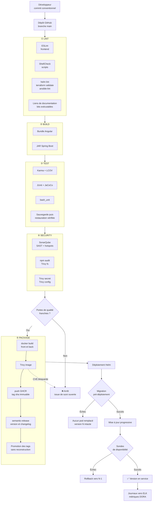
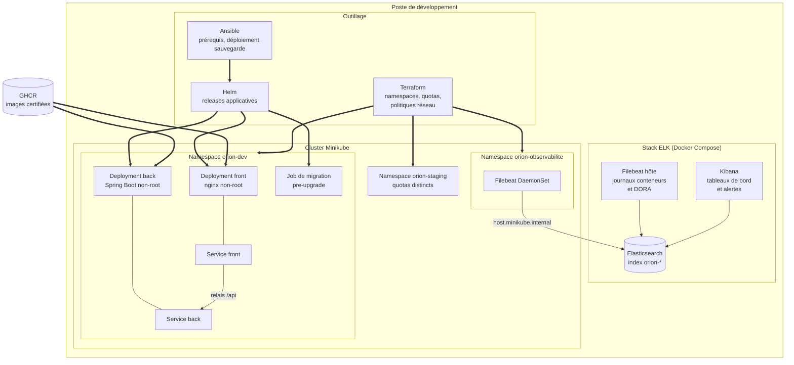
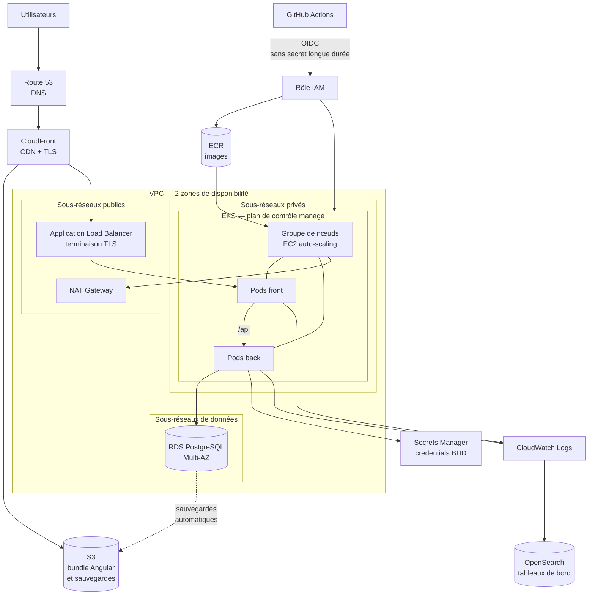
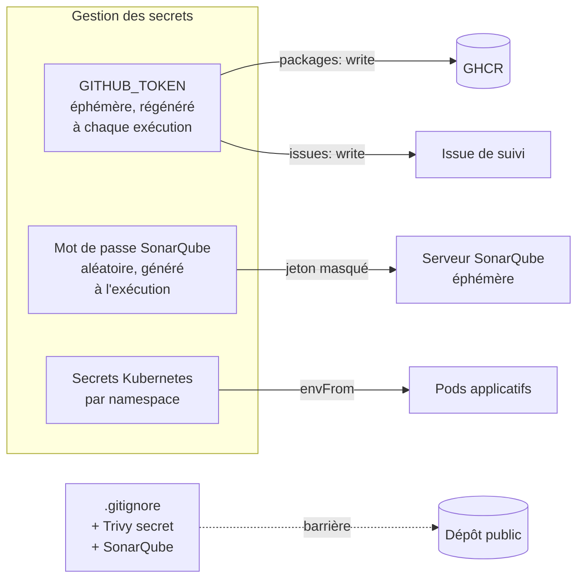

# 06 — Architecture

> **Projet** : P6 « Gérez une démarche DevOps » — Option B (scénario Orion)
> **Auteur** : Ilyasse JAIEL — Expert DevOps
> **Objet** : décrire l'architecture de la chaîne CI/CD, de l'infrastructure locale et de la cible
> cloud. Chaque schéma est accompagné d'une **description textuelle** afin de rester accessible aux
> personnes en situation de handicap visuel et aux lecteurs d'écran (exigence PSH du guide mentor).

---

## Sommaire

1. [Vue d'ensemble](#1-vue-densemble)
2. [Architecture de la chaîne CI/CD](#2-architecture-de-la-chaîne-cicd)
3. [Architecture de l'infrastructure locale](#3-architecture-de-linfrastructure-locale)
4. [Architecture cloud cible](#4-architecture-cloud-cible)
5. [Flux de données et de secrets](#5-flux-de-données-et-de-secrets)
6. [Choix d'architecture et alternatives écartées](#6-choix-darchitecture-et-alternatives-écartées)

---

## 1. Vue d'ensemble

L'architecture repose sur trois plans distincts, volontairement séparés :

| Plan | Rôle | Outils |
|---|---|---|
| **Chaîne d'intégration et de livraison** | Transformer un commit en artefact certifié | GitHub Actions, SonarQube, Trivy, GHCR, semantic-release |
| **Infrastructure d'exécution** | Héberger et exploiter l'application | Kubernetes (Minikube), Helm, Terraform, Ansible |
| **Observabilité** | Mesurer ce qui se passe réellement | Elasticsearch, Kibana, Filebeat, métriques DORA |

Cette séparation n'est pas cosmétique : elle permet de faire évoluer chaque plan indépendamment.
Le passage de Minikube à un cluster managé (§4) ne touche ni la chaîne CI/CD ni l'observabilité.

---

## 2. Architecture de la chaîne CI/CD

### Description textuelle du schéma 2

Un développeur produit un commit conventionnel qui alimente la branche principale du dépôt
GitHub. Le pipeline enchaîne cinq étapes séquentielles.

L'**étape 1 (lint)** regroupe quatre contrôles rapides : ESLint sur le frontend, ShellCheck sur les
scripts, la validation des charts Helm, du code Terraform et des playbooks Ansible, enfin la
vérification des liens de documentation et des bits exécutables.

L'**étape 2 (build)** produit le bundle Angular et le JAR Spring Boot.

L'**étape 3 (test)** exécute les tests Karma avec couverture LCOV, les tests JUnit avec couverture
JaCoCo, les tests bash_unit des scripts, et vérifie un cycle complet de sauvegarde puis restauration.

L'**étape 4 (security)** exécute SonarQube (analyse statique et security hotspots), l'analyse des
dépendances par npm audit et Trivy, ainsi que la recherche de secrets versionnés et de mauvaises
configurations.

Une **porte de qualité** décide ensuite : en cas d'échec, le pipeline s'arrête et une issue de suivi
est ouverte automatiquement. En cas de succès, l'**étape 5 (package)** construit les images, les
scanne avec Trivy, puis — et seulement si le scan est propre — les publie sur GHCR avec un tag
immuable. `semantic-release` produit la version et le changelog, puis promeut les tags sémantiques
sans reconstruire les images. Une flèche de retour indique qu'une CVE bloquante renvoie
directement à l'arrêt du pipeline.

Le déploiement Helm suit. Un Job de migration s'exécute d'abord : s'il échoue, aucun pod n'est
remplacé et la version en service reste intacte. S'il réussit, la mise à jour progressive démarre,
puis les sondes de disponibilité tranchent : échec, retour à la version précédente ; succès, la
version est en service. Les journaux partent alors vers ELK et alimentent les métriques DORA.

**Le point d'architecture à retenir** : le scan Trivy est situé **entre** la construction et la
publication, à l'intérieur du même job. Une image vulnérable n'atteint donc jamais le registre.

---

## 3. Architecture de l'infrastructure locale

### Description textuelle du schéma 3

Tout se déroule sur un poste de développement unique, qui héberge trois ensembles.

Le premier est l'**outillage** : Terraform, qui provisionne les namespaces, leurs quotas et leurs
politiques réseau ; Ansible, qui vérifie les prérequis, orchestre le déploiement et la sauvegarde ;
Helm, qui gère les releases applicatives.

Le deuxième est la **stack ELK**, lancée par Docker Compose : Elasticsearch stocke les index
`orion-*`, Kibana fournit tableaux de bord et alertes, et un Filebeat installé sur l'hôte collecte
les journaux des conteneurs ainsi que les indicateurs DORA. Filebeat et Kibana communiquent tous
deux avec Elasticsearch.

Le troisième est le **cluster Minikube**, découpé en trois namespaces. Le namespace `orion-dev`
contient les déploiements du frontend (nginx en utilisateur non privilégié) et du backend (Spring
Boot en utilisateur non privilégié), chacun exposé par un Service, plus le Job de migration exécuté
avant chaque mise à jour. Le Service du frontend relaie les appels `/api` vers le Service du
backend. Le namespace `orion-staging` reprend la même structure avec des quotas distincts. Le
namespace `orion-observabilite` héberge le DaemonSet Filebeat.

Les flèches épaisses montrent qui agit sur quoi : Terraform crée les trois namespaces, Ansible
pilote Helm, et Helm déploie le frontend, le backend et le Job de migration. Le DaemonSet Filebeat
expédie les journaux des pods vers Elasticsearch en passant par l'adresse `host.minikube.internal`.
Enfin, les images certifiées proviennent du registre GHCR.

---

## 4. Architecture cloud cible

Le guide mentor attend explicitement un schéma d'architecture cloud. Celui-ci décrit la cible
retenue pour Orion, détaillée et chiffrée dans [`09-evolution-cloud.md`](09-evolution-cloud.md).

### Description textuelle du schéma 4

Les utilisateurs atteignent l'application par Route 53 pour la résolution DNS, puis CloudFront qui
assure la diffusion de contenu et la terminaison TLS. CloudFront sert directement le bundle Angular
depuis un bucket S3, qui héberge également les sauvegardes, et transmet les appels applicatifs à un
Application Load Balancer.

Le réseau privé virtuel est réparti sur deux zones de disponibilité et découpé en trois familles de
sous-réseaux. Les **sous-réseaux publics** hébergent le load balancer et une passerelle NAT. Les
**sous-réseaux privés** hébergent le cluster EKS, dont le plan de contrôle est managé, avec un
groupe de nœuds EC2 en auto-scaling qui exécute les pods du frontend et du backend. Les
**sous-réseaux de données** hébergent une base RDS PostgreSQL en configuration Multi-AZ.

Le load balancer transmet le trafic aux pods du frontend, qui relaient `/api` vers les pods du
backend, lesquels accèdent à la base RDS. Les credentials de la base proviennent de Secrets Manager
et non de variables d'environnement. Les nœuds sortent vers Internet par la passerelle NAT.

La chaîne CI/CD s'authentifie par **OIDC**, sans aucun secret de longue durée : GitHub Actions
obtient un rôle IAM temporaire lui donnant accès au registre ECR et au cluster EKS. Les images
publiées sur ECR sont tirées par les nœuds.

Enfin, les pods envoient leurs journaux à CloudWatch Logs, relayés vers OpenSearch pour les tableaux
de bord, et la base RDS produit des sauvegardes automatiques déposées sur S3.

### Correspondance local → cloud

| Local (aujourd'hui) | Cloud (cible) | Ce qui change réellement |
|---|---|---|
| Minikube | **EKS** | Le plan de contrôle devient managé ; les manifestes Helm sont inchangés à 95 % |
| GHCR | **ECR** | Seule l'URL du registre change dans `values.yaml` |
| `kubectl port-forward` | **ALB + Ingress** | Un objet Ingress remplace le port-forward |
| HSQLDB en mémoire | **RDS PostgreSQL Multi-AZ** | Changement applicatif — recommandation n°1 |
| `storageClass: standard` | **EBS gp3** | Une valeur dans `values.yaml` |
| Secrets Kubernetes | **Secrets Manager** | Injection par CSI driver |
| Stack ELK locale | **OpenSearch** | Même modèle de données, service managé |
| Jeton `GITHUB_TOKEN` | **OIDC + rôle IAM** | Aucun secret de longue durée à faire tourner |

---

## 5. Flux de données et de secrets

### Description textuelle du schéma 5

Trois familles de secrets coexistent, et aucune n'est stockée dans le dépôt.

Le `GITHUB_TOKEN` est éphémère et régénéré à chaque exécution du pipeline ; il sert à publier sur
GHCR avec la permission `packages: write` et à ouvrir une issue de suivi avec `issues: write`.

Le mot de passe administrateur de SonarQube est **généré aléatoirement à l'exécution** et le jeton
d'analyse qui en découle est masqué dans les journaux ; ils ne servent qu'au serveur SonarQube
éphémère du pipeline.

Les secrets Kubernetes sont créés par namespace et injectés dans les pods applicatifs par `envFrom`.

Enfin, une barrière représentée en pointillés protège le dépôt public : elle combine le `.gitignore`,
la détection de secrets par Trivy et l'analyse SonarQube. Aucun credential ne peut donc y entrer
sans être signalé.

---

## 6. Choix d'architecture et alternatives écartées

| Choix retenu | Alternative écartée | Motif |
|---|---|---|
| **Deux images, une par composant** | Image « standalone » unique avec supervisord | Deux services dans un conteneur contredisent l'orchestration : Kubernetes doit pouvoir dimensionner et redémarrer chaque composant indépendamment |
| **Relais `/api` par nginx** | URL d'API absolue dans le bundle | Une URL en dur rend l'image dépendante de son environnement ; le relais permet à la **même image** de servir partout |
| **Migrations en Job `pre-upgrade`** | Migration au démarrage de l'application | Chaque réplique rejouerait la migration en concurrence ; et l'échec surviendrait après remplacement des pods |
| **Terraform pour les namespaces, pas les releases** | Tout gérer par Terraform | Les releases changent plusieurs fois par jour : les y inclure ferait de chaque livraison une modification d'infrastructure |
| **Filebeat en DaemonSet** | Filebeat sur l'hôte | Les journaux des pods vivent dans le nœud ; un agent sur l'hôte ne les voit pas |
| **Index séparés logs / DORA** | Index unique | Volumétries, rétentions et schémas différents ; les mélanger rend les agrégations DORA illisibles |
| **Minikube** | EKS dès maintenant | Environ 70 €/mois plus les nœuds, sans bénéfice pour une application hors production. La migration est documentée et chiffrée (`09`) |

---

## Documents liés

| Document | Contenu |
|---|---|
| [`03-normalisation-plan-ci.md`](03-normalisation-plan-ci.md) | Ordre d'exécution du pipeline, argumenté étape par étape |
| [`05-plan-securite.md`](05-plan-securite.md) | Contrôles de sécurité et gestion des secrets |
| [`07-plan-releases-rollback-backup.md`](07-plan-releases-rollback-backup.md) | Procédures de release, de rollback et de sauvegarde |
| [`09-evolution-cloud.md`](09-evolution-cloud.md) | Plan de migration vers le cloud, étapes et coûts |
