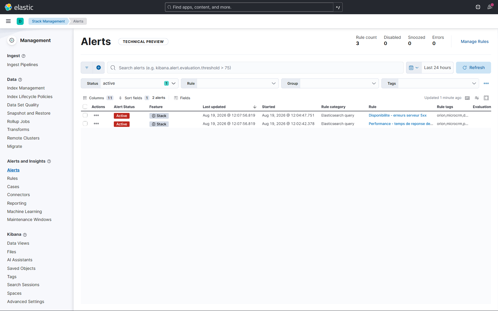
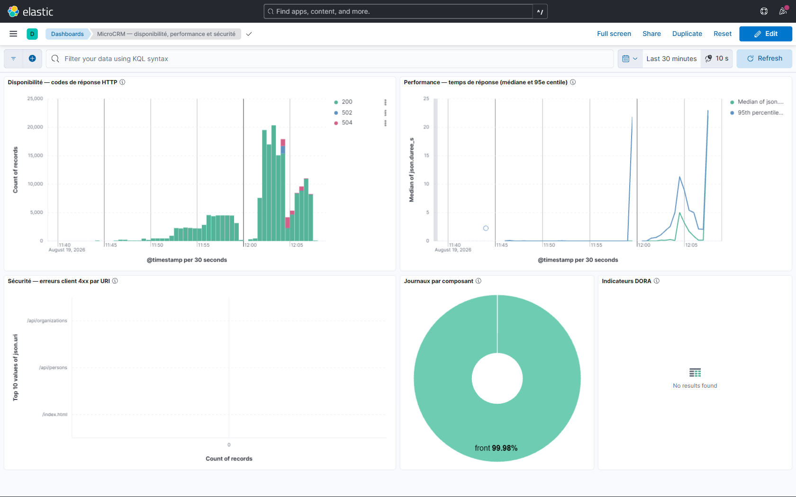

# Tests de charge — MicroCRM

> Campagne exécutée avec **k6** en conteneur, contre l'application déployée sur Kubernetes,
> à travers le Service exposé en NodePort. Résultats bruts : les fichiers
> `resultats-<palier>.json` de ce répertoire.

> **Verdict global : ❌ au moins un seuil dépassé**

## Seuils appliqués — et pourquoi

| Seuil | Valeur | Justification |
|---|---|---|
| 95e centile du temps de réponse | **< 500 ms** | Au-delà d'une demi-seconde, l'utilisateur perçoit l'attente. Le 95e centile plutôt que la moyenne : c'est la lenteur subie par les 5 % les moins bien servis qui fait la réputation d'une application. |
| Taux d'erreur | **< 1 %** | Une erreur sur cent est déjà visible sur un CRM utilisé quotidiennement. |

> Ce sont ces seuils qui font du test un **test** : sans eux, une campagne de charge n'est
> qu'une collecte de chiffres. Ils transforment une mesure en décision.

## Comparaison des paliers

| Palier | Utilisateurs | Requêtes | Débit | p50 | p95 | p99 | Max | Erreurs | Verdict |
|---|---|---|---|---|---|---|---|---|---|
| **nominal** | 5 | 1800 | 11.9 req/s | 2.1 ms | **3.1 ms** | 5.6 ms | 14.2 ms | 0.00 % | ✅ |
| **soutenu** | 25 | 13467 | 64.3 req/s | 1.2 ms | **2.6 ms** | 4.9 ms | 187.8 ms | 0.00 % | ✅ |
| **pointe** | 50 | 27000 | 128.0 req/s | 1.1 ms | **2.3 ms** | 3.5 ms | 21.80 s | 0.00 % | ✅ |
| **saturation** | 300 | 52167 | 190.4 req/s | 297.1 ms | **5.00 s** | 21.89 s | 34.59 s | 5.83 % | ❌ |

## Détail par palier

### Palier « nominal » — 5 utilisateurs virtuels

Mesure de 2m après un échauffement de 30s, exécutée le 2026-08-19 à 15:52:21 UTC.

| Indicateur | Valeur |
|---|---|
| Requêtes mesurées | 1800 |
| Débit | 11.94 req/s |
| Temps de réponse moyen | 1.8 ms |
| Médiane (p50) | 2.1 ms |
| **95e centile (p95)** | **3.1 ms** — seuil 500 ms |
| 99e centile (p99) | 5.6 ms |
| Maximum | 14.2 ms |
| Taux d'erreur | 0.00 % |
| p95 du frontend | 0.5 ms |
| p95 de l'API | 3.3 ms |

### Palier « soutenu » — 25 utilisateurs virtuels

Mesure de 3m après un échauffement de 30s, exécutée le 2026-08-19 à 15:55:51 UTC.

| Indicateur | Valeur |
|---|---|
| Requêtes mesurées | 13467 |
| Débit | 64.32 req/s |
| Temps de réponse moyen | 1.6 ms |
| Médiane (p50) | 1.2 ms |
| **95e centile (p95)** | **2.6 ms** — seuil 500 ms |
| 99e centile (p99) | 4.9 ms |
| Maximum | 187.8 ms |
| Taux d'erreur | 0.00 % |
| p95 du frontend | 0.5 ms |
| p95 de l'API | 3.0 ms |

### Palier « pointe » — 50 utilisateurs virtuels

Mesure de 3m après un échauffement de 30s, exécutée le 2026-08-19 à 15:59:22 UTC.

| Indicateur | Valeur |
|---|---|
| Requêtes mesurées | 27000 |
| Débit | 127.96 req/s |
| Temps de réponse moyen | 17.4 ms |
| Médiane (p50) | 1.1 ms |
| **95e centile (p95)** | **2.3 ms** — seuil 500 ms |
| 99e centile (p99) | 3.5 ms |
| Maximum | 21.80 s |
| Taux d'erreur | 0.00 % |
| p95 du frontend | 0.5 ms |
| p95 de l'API | 2.6 ms |

### Palier « saturation » — 300 utilisateurs virtuels

Mesure de 4m après un échauffement de 30s, exécutée le 2026-08-19 à 16:07:25 UTC.

| Indicateur | Valeur |
|---|---|
| Requêtes mesurées | 52167 |
| Débit | 190.45 req/s |
| Temps de réponse moyen | 1.29 s |
| Médiane (p50) | 297.1 ms |
| **95e centile (p95)** | **5.00 s** — seuil 500 ms |
| 99e centile (p99) | 21.89 s |
| Maximum | 34.59 s |
| Taux d'erreur | 5.83 % |
| p95 du frontend | 592.3 ms |
| p95 de l'API | 5.00 s |

## Le palier de saturation — pourquoi il « échoue » volontairement

Le palier **saturation** (300 utilisateurs virtuels) dépasse les seuils, et c'est son objet. Il ne sert pas à caractériser l'application : il sert à **vérifier que la chaîne d'alerte se déclenche réellement**.

Une alerte configurée mais jamais éprouvée n'est qu'une intention. Les trois premiers paliers, tous conformes, ne pouvaient pas la déclencher — il fallait donc pousser l'application au-delà de tout usage réaliste.

| Mesure au point de saturation | Valeur |
|---|---|
| 95e centile | **5.00 s** |
| 99e centile | 21.89 s |
| Taux d'erreur | **5.83 %** |
| Débit atteint | 190.4 req/s |

**Ce que révèle la saturation** : sous cette charge, le frontend nginx renvoie des erreurs `502` et `504` — il ne parvient plus à joindre le backend dans les délais. Le point de rupture se situe donc **entre 50 et 300 utilisateurs virtuels**, très au-delà de l'usage attendu chez Orion (4 développeurs, 2 exploitants).

## Preuve : les alertes se sont réellement déclenchées



**Description textuelle** (accessibilité PSH) — l'écran « Alerts » de Kibana affiche **2 alertes à l'état « Active »**, sur 3 règles configurées et 0 en erreur. La première, « Disponibilite - erreurs serveur 5xx », s'est déclenchée à 12:04:47 ; la seconde, « Performance - temps de reponse degrade », à 12:02:42. Les deux sont de type *Elasticsearch query*.

Au plus fort de la campagne, la condition surveillée par la règle de performance — plus de 5 requêtes au-delà d'une seconde sur 5 minutes — était dépassée de plusieurs ordres de grandeur : **28 684 requêtes** concernées.



**Description textuelle** (accessibilité PSH) — le tableau de bord, resserré sur 30 minutes, montre la montée en charge : l'histogramme des codes HTTP passe de quelques centaines à plus de 20 000 enregistrements par tranche de 30 secondes, avec apparition de barres `502` et `504` au sommet du pic. Le graphique de performance montre la médiane et le 95e centile décoller de la ligne de base pour dépasser 20 secondes. L'anneau de répartition indique 99,98 % de journaux émis par le frontend, celui-ci absorbant l'essentiel du trafic.

> Le panneau « Indicateurs DORA » apparaît vide sur cette capture : la fenêtre de > 30 minutes exclut les documents DORA, indexés lors d'une campagne antérieure. Ce > n'est pas une anomalie, mais l'effet de la fenêtre temporelle choisie pour rendre le > pic de charge lisible.

## Mise à jour progressive sous charge

Journal complet : [`rolling-update-sous-charge.log`](rolling-update-sous-charge.log).

Un `helm upgrade` a été déclenché **pendant** une campagne soutenue (25 utilisateurs virtuels), portant au passage le frontend à 2 répliques.

| Mesure pendant la bascule | Valeur |
|---|---|
| Requêtes mesurées | 13 500 |
| Débit | 64,21 req/s |
| 95e centile | 2,4 ms |
| Durée de la bascule | 47 s |
| **Taux d'erreur** | **0,00 %** |

**Aucune requête perdue pendant le remplacement des pods.** C'est la démonstration, sous trafic réel, de ce que la configuration promettait :

- `RollingUpdate` avec `maxUnavailable: 0` ne retire un ancien pod qu'après qu'un nouveau soit prêt ;
- les sondes empêchent le Service d'aiguiller vers un pod non prêt ;
- le Job de migration s'exécute avant la bascule sans interrompre le trafic.

## Limites de cette campagne

Ces mesures ont été obtenues sur l'**environnement de démonstration** : cluster Minikube à un nœud, sur un poste de travail, avec une base **HSQLDB en mémoire**.

Elles valident le comportement de la **chaîne et du système** sous charge — disponibilité pendant une mise à jour, déclenchement des alertes, tenue des seuils, position du point de rupture. Elles ne prédisent **pas** les capacités absolues d'une future production : une base de données réelle introduit des latences d'entrées-sorties et des contentions que HSQLDB en mémoire ne reproduit pas.

**Les capacités devront être requalifiées après la migration vers PostgreSQL** (recommandation n°1 du rapport de performance). La méthode, les seuils et l'outillage, eux, resteront valables tels quels.

## Reproduire la campagne

```bash
# Exposer le frontend en NodePort (cible stable d'une mise à jour à l'autre)
helm upgrade microcrm helm/microcrm -n orion-dev \
    -f helm/microcrm/values-dev.yaml --set image.tag=1.2.0 \
    --set service.type=NodePort --wait

# Les trois paliers de caractérisation
./scripts/test-charge.sh

# Le palier de saturation, qui déclenche les alertes
./scripts/test-charge.sh --palier saturation --sans-verdict

# Captures Kibana pendant la charge
node scripts/capturer-kibana.js tableau-de-bord-charge alerte-declenchee
```

> Ce test **n'est pas exécuté par le pipeline** : il exige un cluster déployé et dure > plusieurs minutes, ce qui ferait sortir la chaîne de sa cible de 12 minutes. Il se lance > manuellement, au même titre que `terraform apply`.
