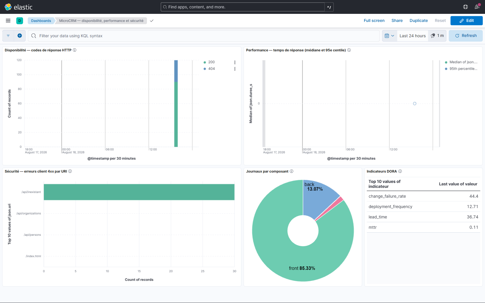
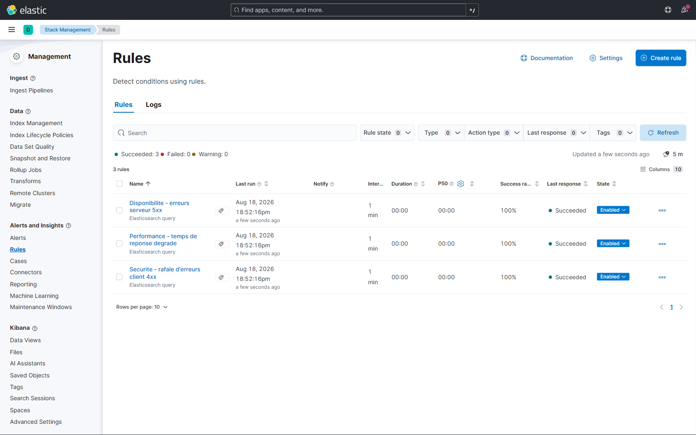

# Preuves — stack ELK, tableaux de bord et alertes

> État **relevé sur la stack réellement en fonctionnement**, journalisé dans
> [`etat-stack.log`](etat-stack.log). Définitions versionnées dans
> [`elk/kibana/`](../../../elk/kibana/).
>
> Répond à la lacune **S7** de l'audit : Orion ne dispose aujourd'hui d'aucun journal centralisé,
> d'aucune alerte, d'aucune traçabilité d'exécution.

## Ce qui est en place

| Élément | État vérifié |
|---|---|
| Cluster Elasticsearch | `green`, 1 nœud |
| Index `orion-k8s-*` | **375 documents** — journaux des pods MicroCRM |
| Index `orion-dora-*` | 4 documents — les quatre indicateurs DORA |
| Index `orion-logs-*` | ~186 000 documents — journaux des conteneurs de l'hôte |
| Vues de données Kibana | 3 |
| Visualisations | 5 |
| Tableau de bord | 1 — disponibilité, performance, sécurité |
| **Règles d'alerte** | **3, activées** |

## Captures d'écran

Deux captures de l'interface Kibana, prises sur la stack réellement en fonctionnement. Elles sont
générées par [`scripts/capturer-kibana.js`](../../../scripts/capturer-kibana.js) — un navigateur sans
interface —, donc **reproductibles** : elles ne dépendent pas d'une manipulation manuelle.

### Tableau de bord



**Description textuelle** (accessibilité PSH) — le tableau de bord affiche cinq panneaux sur une
fenêtre de 24 heures.

En haut à gauche, « Disponibilité — codes de réponse HTTP » : un histogramme empilé où une barre
unique atteint 120 requêtes, composée de réponses 200 en vert (environ 90) et 404 en bleu (environ
30). En haut à droite, « Performance — temps de réponse (médiane et 95e centile) » : une courbe
plate au voisinage de zéro, les temps de réponse étant inférieurs à la milliseconde.

En bas à gauche, « Sécurité — erreurs client 4xx par URI » : un histogramme horizontal où
`/api/inexistant` concentre 30 erreurs, les autres chemins (`/api/organizations`, `/api/persons`,
`/index.html`) n'en comptant aucune. Au centre, « Journaux par composant » : un anneau partagé entre
`front` à 85,33 % et `back` à 13,07 %, le reste revenant au Job de migration.

À droite, « Indicateurs DORA » : un tableau des dernières valeurs — `change_failure_rate` 44,4,
`deployment_frequency` 12,71, `lead_time` 36,74, `mttr` 0,11.

### Règles d'alerte



**Description textuelle** (accessibilité PSH) — l'écran « Rules » de Kibana affiche le compteur
**« Succeeded: 3, Failed: 0, Warning: 0 »** puis les trois règles.

« Disponibilite - erreurs serveur 5xx », « Performance - temps de reponse degrade » et
« Securite - rafale d'erreurs client 4xx » sont toutes de type *Elasticsearch query*, exécutées
toutes les **1 minute**, avec un taux de réussite de **100 %**, une dernière réponse
**« Succeeded »** et l'état **« Enabled »**.

> Ces captures illustrent ; ce sont [`etat-stack.log`](etat-stack.log) et les définitions versionnées
> dans [`elk/kibana/`](../../../elk/kibana/) qui **prouvent**, puisqu'ils sont interrogés par API et
> reproductibles à l'identique.

## Les trois dimensions demandées

### Disponibilité

| Code HTTP | Requêtes |
|---|---|
| 200 | **90** |
| 404 | **30** |

Les 404 proviennent des appels délibérés à `/api/inexistant` lors de la génération de trafic : ils
confirment que le relais `/api` transmet bien les codes du backend, et non une page d'erreur du
frontend.

### Performance

| Centile | Temps de réponse |
|---|---|
| p50 | < 1 ms |
| p95 | < 1 ms |
| p99 | < 1 ms |

**À lire avec précaution.** Ces temps sont ceux d'un cluster local sollicité par `curl`, sans
latence réseau ni charge concurrente. Ils prouvent que la **mesure fonctionne** — la donnée est
structurée, indexée et agrégeable — mais ne disent rien de la tenue en charge réelle. Un test de
charge n'aurait de sens qu'après migration vers PostgreSQL (voir `docs/04-plan-tests.md` §2.2).

### Sécurité

Erreurs client regroupées par URI, ce qui permet de repérer une concentration anormale sur un
chemin — signature d'un balayage automatisé.

### Journaux par composant

| Composant | Lignes |
|---|---|
| `front` | 320 |
| `back` | 49 |
| `back-migration` | 6 |

Le Job de migration apparaît comme un composant à part entière : son exécution est tracée au même
titre que les services, ce qui permet de retrouver après coup pourquoi un déploiement a été bloqué.

## Règles d'alerte

| Règle | Fenêtre | Seuil | Intention |
|---|---|---|---|
| **Disponibilité** — erreurs serveur 5xx | 5 min | **> 0** | Aucune tolérance : une seule 5xx est un incident |
| **Sécurité** — rafale d'erreurs 4xx | 5 min | > 20 | Tolère l'erreur isolée, détecte le balayage |
| **Performance** — temps de réponse dégradé | 5 min | > 5 requêtes au-delà d'1 s | Tolère le pic isolé, détecte la dégradation installée |

Les seuils sont **différenciés à dessein**. Une 5xx signale un service cassé : elle n'a pas de
seuil de tolérance. Une 4xx isolée est un utilisateur qui se trompe d'URL, pas un incident — seule
la rafale mérite une alerte. Une requête lente isolée est un aléa ; cinq en cinq minutes sont une
dégradation.

> Un seuil trop bas produit du bruit, et une alerte qui crie tout le temps finit par être ignorée —
> ce qui revient à ne pas avoir d'alerte du tout.

**Limite assumée** : les règles n'ont **aucune action de notification** attachée (`actions: []`).
Brancher un courriel ou un webhook Slack exigerait un connecteur et des credentials externes, hors
périmètre d'une démonstration locale. Les alertes se déclenchent et sont visibles dans Kibana ; le
branchement d'un canal est une ligne de configuration documentée dans `elk/README.md`.

## Ce qu'il a fallu corriger pour que tout cela existe

Trois défauts ont été rencontrés et résolus — ils sont plus instructifs que le résultat.

| # | Symptôme | Cause réelle | Correction |
|---|---|---|---|
| 1 | Filebeat ne démarrait pas : « no matching index template found for data stream [orion] » | Filebeat 8 crée par défaut un **data stream**, incompatible avec la sortie en index classiques choisie pour séparer journaux et indicateurs DORA | `setup.template.enabled: false` et modèle d'index géré par `scripts/elk-setup.sh` — ce qui permet en prime de **déclarer les types de champs explicitement** |
| 2 | Journaux des pods rejetés : « parsing CRI timestamp » | Le parseur était figé sur `format: cri`, alors que **Minikube avec le pilote Docker journalise au format Docker** | `format: auto` — le collecteur ne dépend plus du runtime du cluster |
| 3 | **Aucune agrégation possible** sur les codes HTTP | nginx journalisait au format texte « combined » : une fois indexée, la ligne est une chaîne indivisible | **Journalisation JSON** (`log_format json_orion`) — sans quoi ni tableau de bord ni alerte n'étaient possibles |

Le troisième est le plus structurant : **il n'existe pas d'observabilité sans données structurées à
la source**. Aucune quantité de configuration Kibana n'aurait permis de compter des codes HTTP
noyés dans du texte libre.

## Pourquoi les tableaux de bord sont générés par script

Les objets Kibana sont produits par un générateur et versionnés dans
[`elk/kibana/objets-sauvegardes.ndjson`](../../../elk/kibana/objets-sauvegardes.ndjson), puis
importés par [`scripts/elk-setup.sh`](../../../scripts/elk-setup.sh).

Un tableau de bord construit à la souris n'existe que dans le volume de la machine qui l'a
construit : si le volume est perdu, tout est perdu, et personne ne peut le reproduire. C'est
exactement le travail manuel non traçable que ce projet vise à éliminer (faiblesse **f3** de
l'audit). Ici, `docker compose up` puis `./scripts/elk-setup.sh` reconstituent l'ensemble.

## Reproduire

```bash
docker compose -f elk/docker-compose.yml up -d      # Elasticsearch, Kibana, Filebeat
kubectl apply -f elk/k8s/filebeat-daemonset.yaml     # collecte des journaux de pods
./scripts/elk-setup.sh                               # modèle, vues, tableaux de bord, alertes
```

Puis ouvrir **http://localhost:5601/app/dashboards** — tableau de bord
« MicroCRM — disponibilité, performance et sécurité ».

Pour produire du trafic et alimenter les graphiques :

```bash
kubectl port-forward -n orion-dev svc/microcrm-front 8081:8080
for i in $(seq 1 30); do
  curl -s -o /dev/null http://localhost:8081/
  curl -s -o /dev/null http://localhost:8081/api/persons
  curl -s -o /dev/null http://localhost:8081/api/inexistant   # produit des 404
done
```

> **Captures d'écran** : ce document et `etat-stack.log` constituent la preuve **vérifiable** de
> l'état de la stack — interrogée par API, horodatée, reproductible. Une capture d'écran de
> l'interface Kibana s'obtient en suivant la procédure ci-dessus ; elle illustre, elle ne prouve
> pas davantage.
